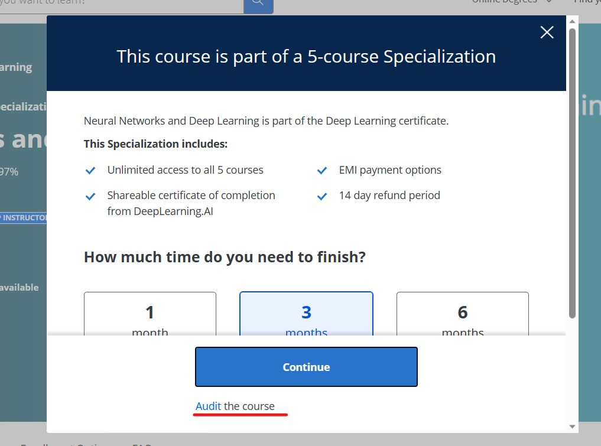

# Week 3

After uderstanding the basics of NLP, and how we can convert words into processable embeddings, we must now understand how we can begin to properly process sentences and then going forward whole bodies of text.  
For up until now, while we have been including information gained from the number and positions of words in sentences, we have not been able to use the _order_ or to be more precise, the **_sequence_** of these words in a sentence.

In Week 3, you will understand the basic concepts behind Recurrent Neural Networks and their working, and use them in this week's assignment to process text. This will be a relatively light week, theory-wise.

This page contains links to section-wise resources on this week's topics. Please go through all of them carefully. The graded assignment for this week will be uploaded shortly.

- [RNN - Coursera Course](#coursera-course)
- [Python Classes](#python-classes)
- [Optimizers](#optimizers)
- [Assignment](#assignment)

## Coursera Course

### **Strongly Recommended**

**Finish [the first two weeks of this course "Sequence Models"](https://www.coursera.org/learn/nlp-sequence-models?) by Andrew Ng on Coursera.**

It contains all the theory behind the concepts that will be covered this week. Week 1 of the course is on sequential neural networks, while Week 2 revisits word embeddings.

You do not need to enrol for the course, you can audit all the content for free.

</img>  
 _Upon pressing the Enroll for Free button, you will see this popup. Click on the "Audit" hyperlink near the bottom, underlined in red_

## Python Classes

Python classes offer a means of bundling data and functionality together, providing you with a simple interface for you to use. Python is an object oriented programming language.

Almost everything in Python is an object, with its properties and methods. Classes are like object constructors, a "blueprint" for creating objects. Here are some resources to give you a basic overview of classes.

- [**Short Introduction**](https://www.geeksforgeeks.org/python-classes-and-objects/)
- [**PyTorch Docs - Implementing models using classes**](https://pytorch.org/tutorials/beginner/introyt/modelsyt_tutorial.html)

## Optimizers

Optimizers play a crucial role in training deep learning models. They are algorithms that adjust the parameters of neural networks during the learning process to minimize the error or loss function. The primary goal of optimizers is to find the optimal set of parameters that best fit the given training data and generalize well to unseen data, with as little computation possible.

There are various optimization algorithms designed to converge to the optimal solution. Few of the popular optimizers used in deep learning include:

- SGD (Stochastic Gradient Descent):  
  This is the fundamental optimizer in deep learning. It updates the parameters after each training sample, making it computationally efficient. However, it may oscillate around the optimal solution due to its noisy updates.

- Adam (Adaptive Moment Estimation):  
  Adam uses adaptive learning rates for each parameter and maintains exponentially decaying average of past squared gradients and past gradients. Adam is widely used and often performs well in practice.

Here are a few resources on the topic, although only a understanding of the trade=offs between techniques is required.

- [**PyTorch Docs - Optimizers**](https://pytorch.org/docs/stable/optim.html)
- [**Explanation of the most common optimizers**](https://towardsdatascience.com/optimizers-for-training-neural-network-59450d71caf6)
- [**CS231n Material**](https://cs231n.github.io/neural-networks-3/#update)

## Assignment

## Assignment

This week's assignment has been released. Open [**Sentiment*Analysis_using_LSTM*(Graded).ipynb**](https://colab.research.google.com/drive/1l1dxNj0NfBgdoSiIE-f8AB_syvqYa7sK?usp=sharing) in Colaboratory, and save a copy of the notebook to your own Drive. Again, due to issues with how some Markdown elements are rendered on GitHub, the notebook has not been added to the repo this time.

You will also have to download the `reviews.csv` dataset from [**this link**](https://drive.google.com/file/d/1nqmfdx7dj5qgynVwzD1CMjFFZoBeKrmD/view?usp=drive_link), and upload it to your Drive.

**Make sure that you save both the Colab Notebook and dataset to the same account**

Submission will be taken via [**this google form**](https://forms.gle/X2Si27maHUnuxAQY6)
