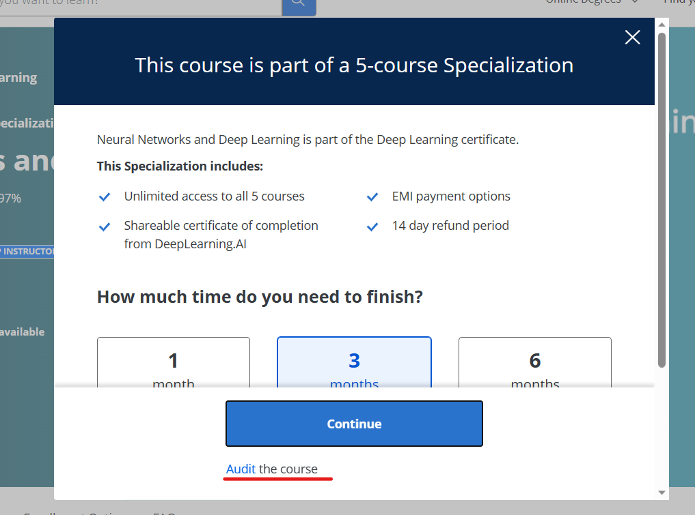

# Week 4

We now enter the final week of the course, where we will finally be dealing with arguably the most awaited concepts of the course - transformers and LLMs.

In Week 4, you will explore the seemingly complex structure of transformers, and uncover the simple components inside them that together power a large portion of the ongoing AI revolution. You will also learn about the most important innovation from previous sequential data processing techniques- **attention**. We will end by looking at how they power Large Language Models, like the now ubiquitous GPTs.

This page contains links to section-wise resources on this week's topics. Please go through all of them carefully.

An optional assignment on Hugging Face 🤗 libraries has been released. There will be no graded assignment this week, final project details will be uploaded shortly.

- [Coursera Course](#coursera-course)
- [Transformers](#transformers)
  - [Large Language Models](#large-language-models-llm)
  - [Decoding Strategies](#decoding-strategies)
- [Hugging-Face 🤗](#hugging-face-🤗)
  - [Transformers Library](#transformers-library)
  - [Gradio](#gradio)
- [Fine-Tuning Pretrained LLMs](#fine-tuning-pretrained-llms)
- [Assignment](#assignment)

## Coursera Course

**Finish [the remaining two weeks of this course "Sequence Models"](https://www.coursera.org/learn/nlp-sequence-models?) by Andrew Ng on Coursera.**

It will cover most of the theory behind attention mechanisms and transformers, although more resources regarding the same will be provided to you below.

You do not need to enrol for the course, you can audit all the content for free.

</img>  
 _Upon pressing the Enroll for Free button, you will see this popup. Click on the "Audit" hyperlink near the bottom, underlined in red_

## Transformers

Transformers mark a significant leap in neural networks for processing sequences, like text. This is made possible by **self-attention**, a crucial element that lets them analyze all elements in a sequence at once, not sequentially.

It's like understanding the context of each puzzle piece based on its connection with others. Self-attention helps the model grasp how each element relates to the rest. This ability makes transformers excellent at tasks where the context and relations between elements matter. This innovation has propelled AI's capabilities in various applications involving sequences, especially in applications related to NLP.

- [**The Illustrated Transformer**](http://jalammar.github.io/illustrated-transformer/), a very informative and easy to understand post on how transformers work
- [**Youtube Video**](https://www.youtube.com/watch?v=zxQyTK8quyY) by StatQuest with Josh Starmer

### Large Language Models (LLM)

Large Language Models, like transformers, represent a substantial advancement in neural networks for comprehending language intricacies. Self-attention empowers them to process entire sentences holistically rather than sequentially word by word. This capability enables words to derive meaning from others in a sophisticated, interwoven manner, leading to high proficiency in tasks like translation, where understanding word context is paramount.

Most LLMs nowadays use transformer architecture, and the terms are quite often used interchangeably. The major difference that LLMs have in comparision to traditional language models is that at such massive scales with large amounts of training data, these models start to exhibit "emergent properties" like **zero-shot learning**, where models are able to perform tasks they were never explicitly trained for with remarkable proficiency.

- [**An introductory guide to LLM**](https://research.aimultiple.com/large-language-models/)
- [**Geeks for Geeks article on LLM**](https://www.geeksforgeeks.org/large-language-model-llm/)

### Decoding Strategies

Decoding strategies refer to techniques used to influence the output sequences generated from the model's learned representations - the process of producing meaningful and coherent sequences of text based on the model's predictions. While it might seem like the right choice would be to always use the most probable prediction by the network, this many times leads to repititive and unnatural results. Many different strategies like random sampling and temperature scaling are employed - usually in combination - to get the desired kind of responses.

- [**Hugging Face blog post**](https://huggingface.co/blog/how-to-generate)
- [**Temperature and sampling strategies**](https://txt.cohere.com/llm-parameters-best-outputs-language-ai/)
- [**Concise Medium article**](https://towardsdatascience.com/decoding-strategies-that-you-need-to-know-for-response-generation-ba95ee0faadc) with helpful graphs

## Hugging Face 🤗

Hugging Face 🤗, most commonly referred to as just 🤗, is an open-source community that is well-known for its contributions to natural language processing (NLP) and artificial intelligence (AI). It provides a platform for researchers, developers, and practitioners to access, share, and collaborate on various NLP models, tools, and resources.

### Transformers Library

Hugging Face is particularly famous for its **`Transformers`** library, which has become a central hub for a wide range of pre-trained language models, including GPT variants, BERT, and other popular architectures. This library allows users to easily integrate and fine-tune these pre-trained models for various NLP tasks, such as text classification, named entity recognition, sentiment analysis, and more.

- [**Documentation for Transformers**](https://huggingface.co/docs/transformers/index)

### Gradio

**`Gradio`** is an open-source Python library by HuggingFace that simplifies the process of creating user interfaces for machine learning models. It allows users to quickly build interactive interfaces for their models, enabling users to interact with and test the models' performance without requiring extensive coding knowledge. It supports a variety of input types making it easy to design intuitive user interfaces for different types of models and tasks.

By using Gradio, you can showcase your models, demonstrate their capabilities, and gather feedback from users in a more interactive and accessible manner.

- [**Documentation for Gradio**](https://www.gradio.app/docs/interface)

## Fine-tuning Pretrained LLMs

Building an LLM from scratch is no easy task; it requires a massive amount of training data and computational power for pre-training. Hence it is much more efficient to simply fine-tune a pretrained LLM that can be imported, say from the Transformers library of Hugging Face. Fine-tuning is a process in which we limit the LLM to performing certain specific tasks, by re-training it on a specific dataset. Doing this not only specializes the LLM and makes it adapt to our needs; it also increases the model's accuracy on these specified tasks significantly.

Refer to the below links to get an idea of the pretraining process, and you will be able to appreciate the use of fine-tuning a lot more.

- [**Brief theoretical overview**]([https://towardsdatascience.com/different-ways-of-training-llms-c57885f388ed](https://medium.com/@atmabodha/pre-training-fine-tuning-and-in-context-learning-in-large-language-models-llms-dd483707b122))
- [**More detailed article**](https://www.nitorinfotech.com/blog/training-large-language-models-llms-techniques-and-best-practices/)

Here are some resources on the fine-tuning process as well.

-[**Stepwise guide**](https://www.simform.com/blog/completeguide-finetuning-llm/#:~:text=Fine%2Dtuning%20in%20large%20language,your%20specific%20business%20use%20cases.)

## Assignment

An optional assignment [**Simple_QnA_Bot_HF_Transformers_Gradio.ipynb**](https://colab.research.google.com/drive/1-5PAyssk8neEKlh1ce6WXfnqwTzXH3aS?usp=sharing) to familiarize yourself with both Hugging Face 🤗 libraries.

There will be no graded assignment for Week 4. Final project details will be released shortly.
